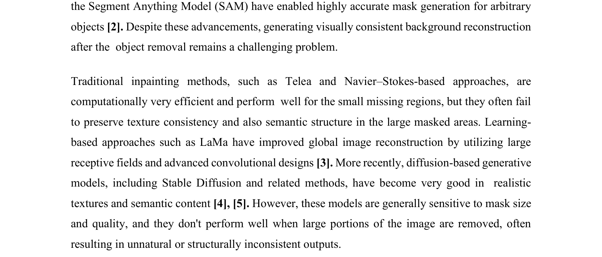
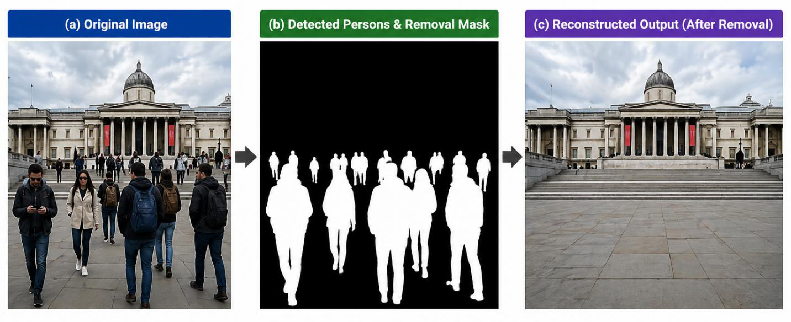
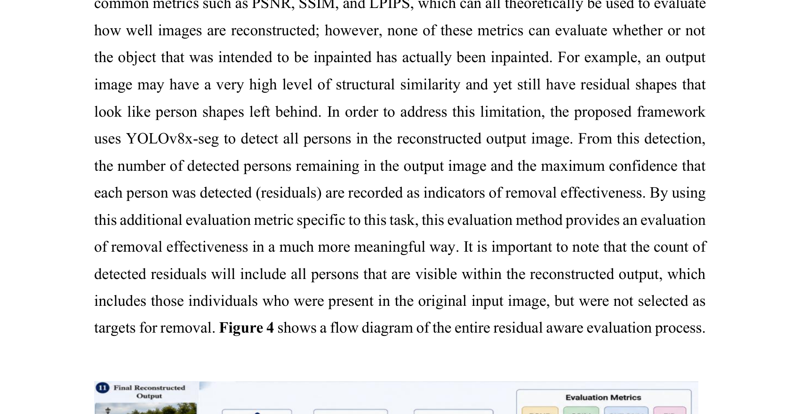
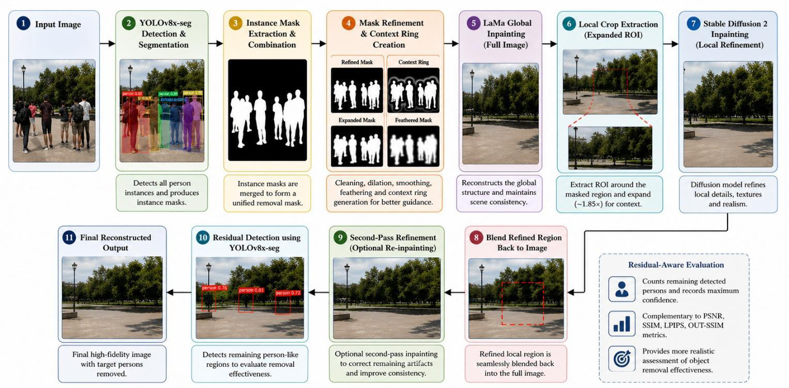
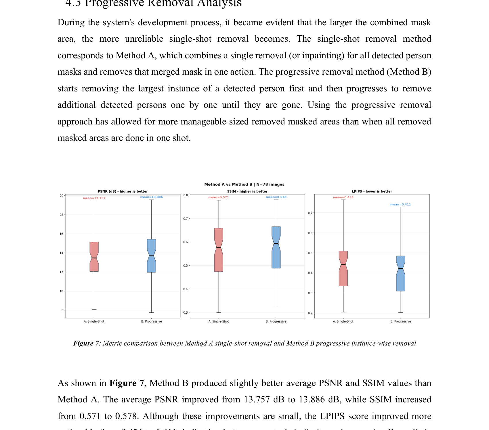
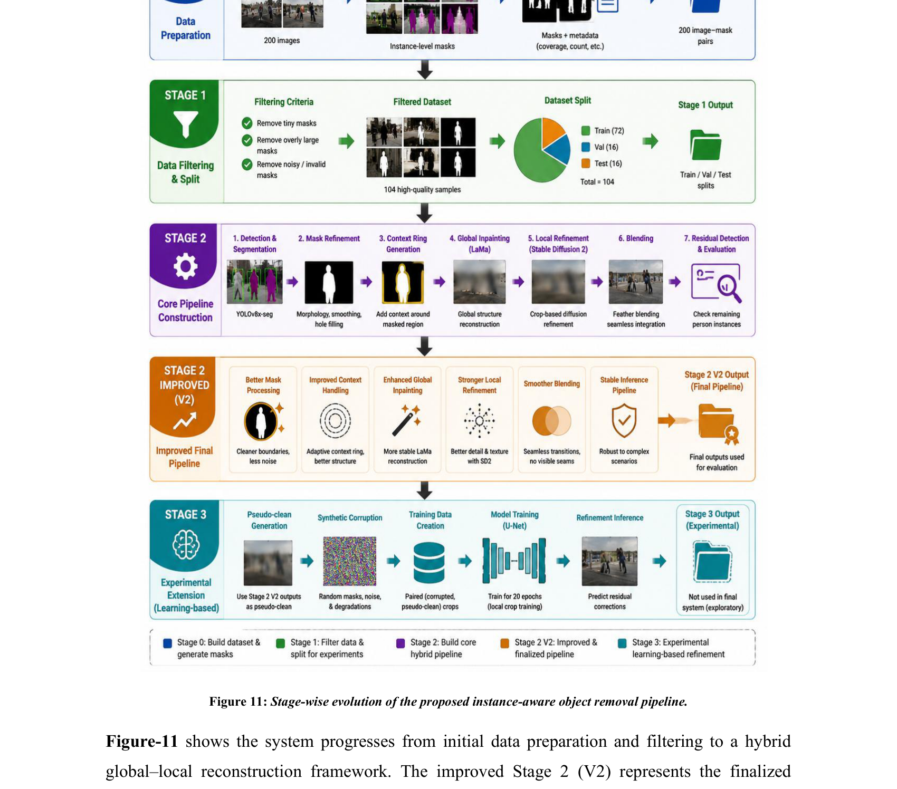

# PhantomFill — Instance-Aware Object Removal & High-Fidelity Background Reconstruction


> **Full title:** *Instance-Aware Object Removal and Background Reconstruction Using Hybrid Inpainting with Comprehensive Evaluation*

Removing people from crowded, real-world photos and rebuilding the hidden background so the edit looks natural is a genuinely hard problem. Classical inpainting smears textures and leaves halos; diffusion inpainting produces plausible textures but breaks down when a large region is masked. **PhantomFill** addresses this with a structured, multi-stage pipeline that detects and segments every person, refines the removal mask, reconstructs the background with a **hybrid global (LaMa) + local (Stable Diffusion 2)** strategy, and — crucially — introduces a **residual-aware evaluation** that checks whether the removed people are still detectable in the output.

This work was developed for **CSE 498R: Directed Research (Spring 2026)** at North South University under the supervision of **Dr. Jilan Samiuddin**.

---

## Goal


*Figure 1: Original image → detected persons and removal mask → reconstructed output after removal.*

Given a real-world multi-person scene, the system removes the target people and reconstructs a background that is visually coherent and structurally consistent with the untouched regions.

---

## Approach

PhantomFill is built as a coordinated multi-stage framework rather than a single-step inpainting call.

### 1. Detection & Segmentation
`YOLOv8x-seg` detects and segments every person in one automated pass (confidence threshold 0.25), producing instance masks that are merged into a unified removal mask.

### 2. Mask Refinement


*Figure 2: Raw mask → cleaned binary → dilated → smoothed → feathered context ring.*

Raw segmentation masks are cleaned with morphological open/close (noise removal, hole filling), dilated for full coverage, Gaussian-smoothed, and feathered. A surrounding **context ring** provides spatial reference for the reconstruction models.

### 3. Hybrid Global–Local Reconstruction
* **Global (LaMa):** reconstructs the overall scene structure efficiently and preserves global layout, avoiding the extreme hallucination of diffusion-only inpainting.
* **Local (Stable Diffusion 2):** a crop around the removed region (≈1.85× expansion, resized to 512×512, 30 inference steps, guidance 7.5) is refined for texture and realism, then blended back seamlessly.

### 4. Second-Pass Refinement
A follow-up pass re-checks the output with `YOLOv8x-seg` (conf > 0.20) and re-inpaints any remaining person-like regions with a slightly larger mask.

### 5. Residual-Aware Evaluation
Standard metrics (PSNR, SSIM, LPIPS) measure reconstruction quality but cannot tell whether the object was actually *removed*. PhantomFill re-runs person detection on the output and records the **count and confidence of remaining detections** as a direct measure of removal effectiveness — alongside **OUT-SSIM**, which verifies the non-masked regions are preserved.

---

## System Architecture


*Figure 5: End-to-end pipeline — detection → mask refinement → context ring → LaMa global inpainting → local crop → Stable Diffusion 2 refinement → blending → second-pass → residual-aware evaluation.*

---

## Results

Evaluated on a filtered subset of **104 multi-person images** from MS COCO (200 collected, filtered by mask-area ratio).

**Final proposed pipeline (Stage 2 V2):**

| Metric              | Value    |
| ------------------- | -------- |
| PSNR (region) ↑     | 18.17    |
| SSIM (region) ↑     | 0.713    |
| OUT-SSIM ↑          | 0.774    |
| Residual count ↓    | 6.96     |
| LaMa global time    | 0.92 s   |
| Local diffusion time| 7.01 s   |
| Total time / image  | 7.94 s   |

**Progressive vs single-shot removal:** removing people one instance at a time (largest-first), re-inpainting after each step, improved perceptual quality — LPIPS won on **72 of 78 images (92.3%)** over naive single-shot removal.


*Figure 6: Visual comparison across Navier–Stokes, Telea, LaMa, Stable Diffusion, and the hybrid method.*


*Figure 12: Qualitative outputs of the final pipeline — input, removal mask, global LaMa result, and final fused result.*

**Key finding:** high reconstruction quality does not guarantee complete removal. A method can score well on PSNR/SSIM while still leaving detectable person-like traces — which is exactly why the residual-aware metric matters.

---

## Pipeline Evolution


*Figure 11: Stage 0 (dataset + masks) → Stage 1 (filtering + split) → Stage 2 (core hybrid pipeline) → Stage 2 V2 (finalized) → Stage 3 (experimental learning-based refinement).*

---

## Repository Structure

```text
CSE-498R-Directed-Research/
├── assets/                             # Figures used in this README
├── 498R Proposal Form.pdf              # Research proposal
├── Work plan.pdf                       # Weekly work plan and methodology
├── update1/                            # Early masking & removal tests
├── update2/                            # Batch experiments
├── update3/                            # Diffusion inpainting baseline
├── Update_5_cse_498R.ipynb            # Consolidated pipeline update
├── Week_4_AZ.zip                       # Week-4 results (figures, metrics.csv, grids)
└── WEEK-6/
    ├── statistical_analysis_week6.ipynb        # Mask coverage vs quality analysis
    └── week-6 updates/
        ├── cse498r_final_stage0_colab.ipynb    # Dataset → auto mask generation
        ├── cse498r_final_stage1_colab.ipynb    # Selective segmentation + inpainting
        ├── cse498r_final_stage2_advanced_colab.ipynb
        ├── cse498r_final_stage2_improved_v2.ipynb   # Final proposed pipeline
        └── stage3_V1(learning_based_local_refinement_model).ipynb
```

The `stage2_improved_v2` notebook is the finalized pipeline used for evaluation.

---

## Getting Started

The notebooks run in **Google Colab** (GPU runtime recommended; T4 or A100).

1. Open `WEEK-6/week-6 updates/cse498r_final_stage2_improved_v2.ipynb` in Google Colab.
2. Enable a GPU runtime: *Runtime → Change runtime type → GPU*.
3. Run the setup cell to install dependencies:
   ```bash
   pip install ultralytics simple-lama-inpainting diffusers transformers \
               lpips opencv-python-headless Pillow matplotlib pandas tqdm scikit-image
   ```
4. Upload a dataset ZIP of person images (MS COCO subset), or mount Google Drive.
5. Run the cells in order: dataset extraction → mask generation → refinement → LaMa → Stable Diffusion refinement → residual-aware evaluation. Metrics are written to CSV for analysis.

---

## Methods & Tools

| Component             | Tool / Model                    |
| --------------------- | ------------------------------- |
| Detection & segmentation | YOLOv8x-seg (Ultralytics)    |
| Global inpainting     | LaMa (`simple-lama-inpainting`) |
| Local refinement      | Stable Diffusion 2 (Diffusers)  |
| Mask processing       | OpenCV (morphology, feathering) |
| Metrics               | PSNR, SSIM, OUT-SSIM, LPIPS + residual detection |
| Dataset               | MS COCO (multi-person subset)   |
| Environment           | Google Colab / Kaggle (PyTorch, CUDA GPU) |

---

## Limitations & Future Work

* No clean ground-truth backgrounds exist for real COCO scenes, so evaluation relies on proxy and residual-based metrics.
* Complete semantic removal in dense, heavily overlapping crowds remains unsolved (avg. ~6.96 residual detections).
* Diffusion refinement is computationally heavy (~7.9 s/image) — not yet real-time.
* **Future:** synthetic paired ground-truth dataset, detector-guided residual refinement loop, YOLO+SAM ensemble masks, and ControlNet-guided diffusion to reduce hallucination.

---

## Team & Academic Context

* **Course:** CSE 498R — Directed Research (Spring 2026)
* **Institution:** North South University, Department of Electrical and Computer Engineering
* **Supervisor:** Dr. Jilan Samiuddin (Assistant Professor, ECE)

| Team Member          | Student ID |
| -------------------- | ---------- |
| Md. Minhajul Islam   | 2211022042 |
| Azmain Iqtidar Arnob | 2211786042 |
| Aqib Ahmed           | 2211335042 |
| Atikul Islam Nahid   | 2211978042 |
